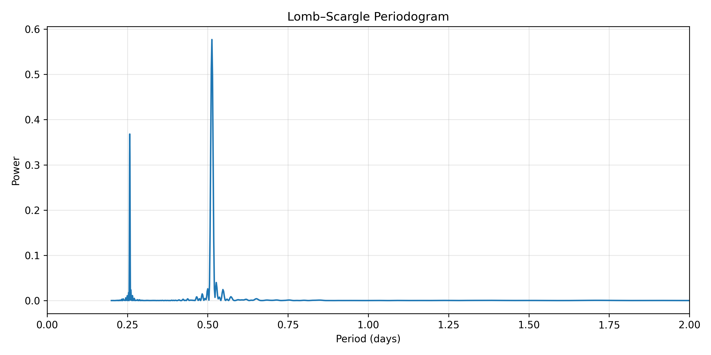

# Lomb–Scargle Period Finder

Recover stellar periods from TESS light curves using Lomb–Scargle analysis.

## Features

- Download TESS light curves
- Recover stellar periods
- Compute Lomb–Scargle periodograms
- Visualize period peaks
- Save output figures

## Dataset

Mission:

**TESS (Transiting Exoplanet Survey Satellite)**

Target:

**AB Dor**

Recovered period:

**~0.51 days**

Reference rotation period:

**0.514 days** :contentReference[oaicite:0]{index=0}

## Output Preview

## Tools Used

- Python
- Astropy
- Lightkurve
- NumPy
- Matplotlib

## Scientific Context

Lomb–Scargle analysis is commonly used for:

- Stellar rotation studies
- Variable stars
- Gyrochronology
- Period recovery
- Time-series astronomy

This project recovers the rotation period of AB Dor from TESS observations.

